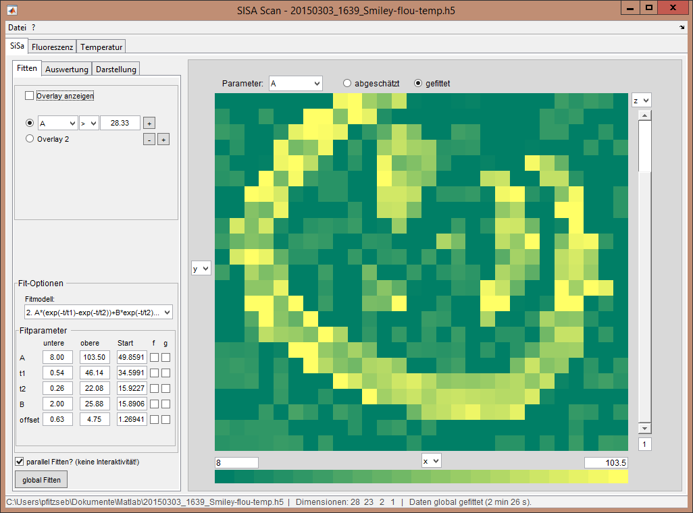

## SiSa-Scan Auswerte-Software
---
&nbsp;&nbsp;&nbsp;&nbsp;&nbsp;&nbsp;&nbsp;&nbsp;&nbsp;  

Mit dieser Software lassen sich die an den Scanning-Messplätzen gewonnen Datensätze
und auch generische `*.diff`s leicht auswerten und in ansprechendem Format visualisieren.

### Installation
#### Binaries
Die Binary-Versionen sollten immer einigermaßen stabil sein, enthalten aber im 
Allgemeinen nicht die neusten Features und Bugfixes.

- Ist die MATLAB Compiler Runtime v8.5 (R2015a) nicht installiert,
dann bitte den [64-bit Installer R2015a (8.5)](http://de.mathworks.com/products/compiler/mcr/index.html)
herunterladen und ausführen. Dann mit dem nächsten Schritt weiter machen.

- Andernfalls reicht es, den Inhalt [diese exe](https://git.daten.tk/sebastian.pfitzner/sisa-scan-auswertung/raw/master/Deployment/SiSaScanAuswertung/standalone/SiSaScanAuswertung.exe)
herunterzuladen und auszuführen.

#### m-Files
Zum Installieren

- `git clone` in ein Verzeichnis
- oben rechts auf `Download zip` drücken und irgendwo entpacken

und dann `startUI` in diesem Verzeichnis ausführen.

### Hinweise

- Der state des gerade laufenden Programms lässt sich mit `Datei`->`State speichern`
speichern und über `Datei`->`Datei öffnen...` wieder laden. Dabei wird allerdings
die gerade laufende Version der Software mitgespeichert, sodass beim Upgrade auf 
eine neue Version und anschließendem Laden des states einer alten Version auch die
alte Version mit allen Bugs (ähh, Features) wiederhergestellt wird.
- Die Binaries haben eine Versionskontrolle eingebaut, die beim Start auf neue
Binary-Versionen checkt. Dazu ist natürlich eine Internetverbindung erforderlich.

---
#### Wichtig!
Matlab wurde mit Version R2014b auf ein neues Plot-Backend umgestellt. 
Bei Matlab R2014a lässt sich das neue Backend auch verwenden, indem Matlab mit 
`-hgVersion 2` ausgeführt wird.

Nach commit f32776dd wird nur noch mit dem neuen Backend entwickelt, also wird
die Software ohne diese Einstellung und/oder in alten Matlab-Versionen vermtl.
schrecklich aussehen. Die Funktionsfähigkeit sollte aber erhalten bleiben.

Die Binaries sind ab f79c56c3 mit R2014b kompiliert.

In [diesem](https://git.daten.tk/sebastian.pfitzner/sisa-scan-auswertung/tree/R2014a-kompatibel) 
Branch sind noch die alten hg1-kompatiblen Files und Binaries enthalten.